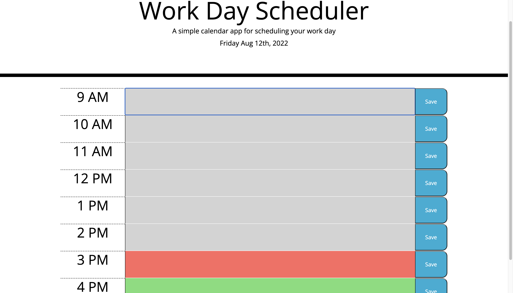
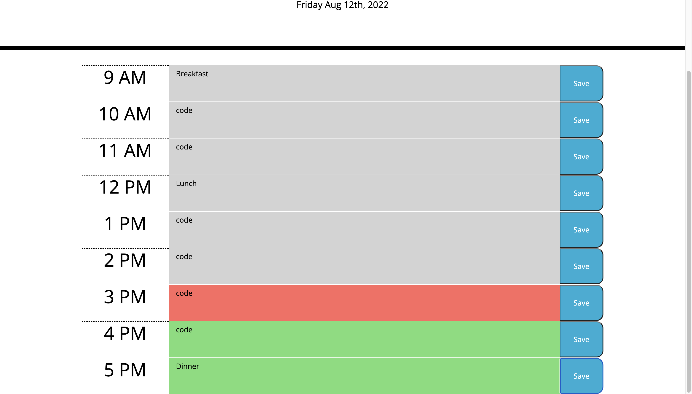

# Work-Day-Scheduler


## Table of Contents 

- [Description](#description)
- [Installation](#installation)
- [Usage](#usage)
- [User-Story](#user-story)
- [Acceptance-Criteria](#acceptance-criteria)
- [Change-Log](#change-log)
- [technologies](#technologies)
- [License](#license)

---

## Project Description 

For my 5th Challenge its time to make a Day Scheduler! This will allow me to save my todo's by time and works with real time to display by color which times are past, present and Future. My projects are on display via Github, with clickable images as well as my resume in a clickable PDF file. 

---

## Installation

To view the project, clone the git repository using VS Code. this will allow you to vie the index.html file ass well as the css style file. The website can be view by right clicking in the index.html file and opening via web browser.

Link to deployed website: https://github.com/meyerbw10/Work-Day-Scheduler

---

### Usage





---

## User Story

AS AN employee with a busy schedule
I WANT to add important events to a daily planner
SO THAT I can manage my time effectively

---

#### Acceptance Criteria

```md
GIVEN I am using a daily planner to create a schedule
WHEN I open the planner
THEN the current day is displayed at the top of the calendar
WHEN I scroll down
THEN I am presented with timeblocks for standard business hours
WHEN I view the timeblocks for that day
THEN each timeblock is color coded to indicate whether it is in the past, present, or future
WHEN I click into a timeblock
THEN I can enter an event
WHEN I click the save button for that timeblock
THEN the text for that event is saved in local storage
WHEN I refresh the page
THEN the saved events persist
```
---


## Change Log
## v1.0.0

- adding html, css, js and read me files
- updating Readme
- Updating everything 
- Final ReadMe
- Final Touches


---

#### Technologies

- HTML
- CSS
- Javascript
- Web API's 
- DOM Traversal


---

### License

Copyright (c) 2022 Bradley Meyer

Permission is hereby granted, free of charge, to any person obtaining a copy of this software and associated documentation files (the "Software"), to deal in the Software without restriction, including without limitation the rights to use, copy, modify, merge, publish, distribute, sublicense, and/or sell copies of the Software, and to permit persons to whom the Software is furnished to do so, subject to the following conditions:

The above copyright notice and this permission notice shall be included in all copies or substantial portions of the Software.

THE SOFTWARE IS PROVIDED "AS IS", WITHOUT WARRANTY OF ANY KIND, EXPRESS OR IMPLIED, INCLUDING BUT NOT LIMITED TO THE WARRANTIES OF MERCHANTABILITY, FITNESS FOR A PARTICULAR PURPOSE AND NONINFRINGEMENT. IN NO EVENT SHALL THE AUTHORS OR COPYRIGHT HOLDERS BE LIABLE FOR ANY CLAIM, DAMAGES OR OTHER LIABILITY, WHETHER IN AN ACTION OF CONTRACT, TORT OR OTHERWISE, ARISING FROM, OUT OF OR IN CONNECTION WITH THE SOFTWARE OR THE USE OR OTHER DEALINGS IN THE SOFTWARE.
